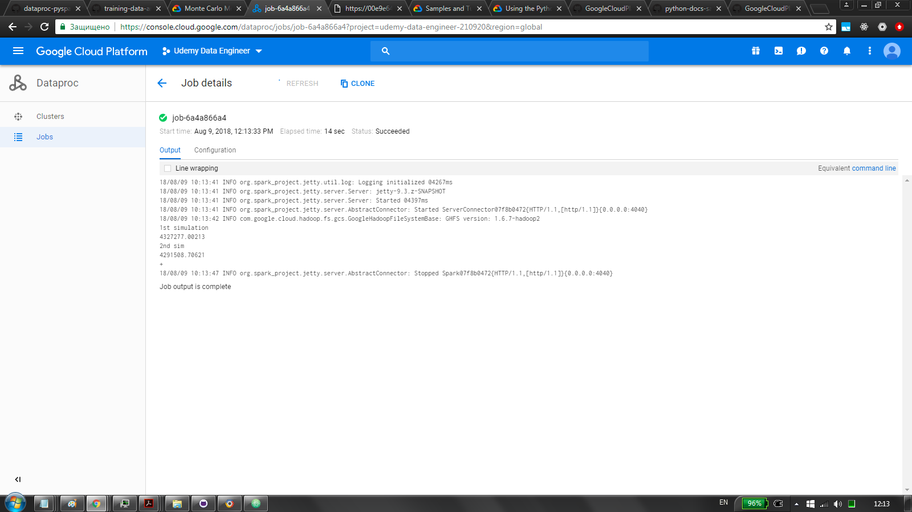

# dataproc-pyspark-monte-carlo
Monte Carlo simulations with PySpark on GCP Cloud Dataproc clusters
as per https://cloud.google.com/solutions/monte-carlo-methods-with-hadoop-spark

## Dataproc
via cloud shell: \
`chmod u+x init.sh` \
`./init.sh` \
creates cluster, uploads job to bucket

## PySpark
simulates portfolio growth under gaussian distribution

